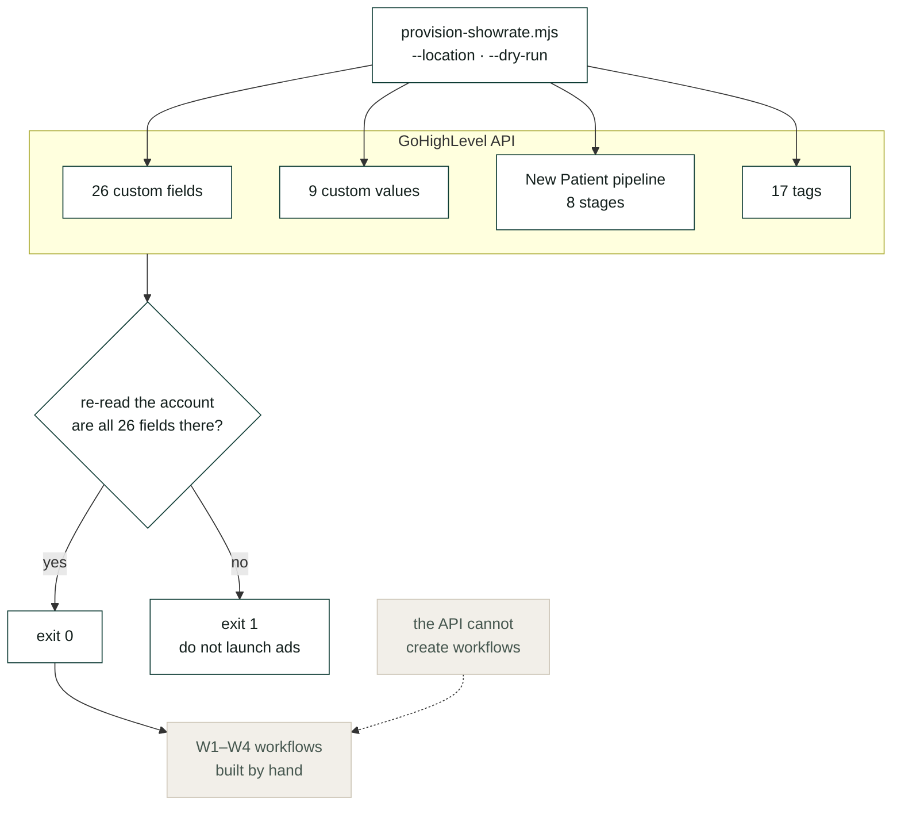

# GHL Provisioner

**Builds a clinic's GoHighLevel account from the command line — then re-reads it
to check the writes actually landed.**

[](https://nodejs.org)
[](https://highlevel.stoplight.io)
[](LICENSE)

```bash
export GHL_API_TOKEN=...
node scripts/provision-showrate.mjs --location <locationId> --dry-run
node scripts/provision-showrate.mjs --location <locationId>
```

`--dry-run` needs no token — it prints the plan without calling the API, which
is precisely when reviewing the plan is most useful.

---

## The problem

Onboarding a client into GoHighLevel is fifteen manual steps. Every one is easy.
Doing them identically, four times a week, for a year, is not.

What goes wrong is never dramatic. Somebody skips the `gclid` custom field.
Nothing errors. Ads launch. Six weeks later that client's attribution is blank
and nobody can say when it broke — because it never broke. It was never built.

## Architecture



## What it creates

```
Custom fields   26   attribution (gclid, fbclid, msclkid, utm_*), confirmation
                     state, no-show counts, intake status
Custom values    9   clinic name, address, map link, practitioner, reschedule link
Pipeline         1   New Patient, 8 stages
Tags            17   source, confirmation and recycling vocabulary
```

Two stages carry weight. **Confirmed** is separate from **Booked** because a
booking somebody replied to and a booking they ignored have very different show
rates — merge them and the pipeline can no longer tell you which of your bookings
are real. **Attended** is the only stage that means money, and every downstream
report joins on that name, so it has to be spelled exactly that.

## The part that matters

It ends by re-reading the account and confirming all 26 fields are present,
exiting non-zero if any is missing.

```
  all 26 fields confirmed present
```

Checking a create call returned `200` is not the same as checking the field
exists. A provisioning run that reports success because nothing errored will hand
somebody a half-built account, and the difference surfaces six weeks later in a
report that is quietly empty.

Safe to re-run: *already exists* counts as success, not failure.

## An honest limit

**GoHighLevel's public API cannot create workflows.** Custom fields, custom
values, pipelines, tags, calendars and contacts are all API-manageable. The
workflow builder is not.

So this splits along that line deliberately:

- everything a machine can create **and verify**, the script creates and verifies
- everything a human has to click is specified in
  [`docs/workflow-specs.md`](docs/workflow-specs.md), precisely enough that two
  people build the same thing

That isn't a workaround. It is the honest shape of the platform, and pretending
otherwise produces provisioning scripts that silently half-work.

## Also here

| Doc | |
|---|---|
| [`docs/workflow-specs.md`](docs/workflow-specs.md) | W1–W4 as a build sheet, with the full message library |
| [`docs/build-checklist.md`](docs/build-checklist.md) | Pre-launch. Every item has failed on a real account |

The checklist's last item decides whether any of this reports anything:
**somebody at the front desk has to mark appointments attended.** Train it before
launch and check it in week one — a system measuring a field nobody fills in is
measuring nothing, and under pay-per-show it is also under-billing.

## Where this sits

It provisions the account [`frontdesk`](https://github.com/maqbuuul/frontdesk)
books into, and produces the attendance data
[`pay-per-show`](https://github.com/maqbuuul/pay-per-show) invoices from.

---

Built by [Abdiwahid Ali](https://github.com/maqbuuul). Nairobi.
