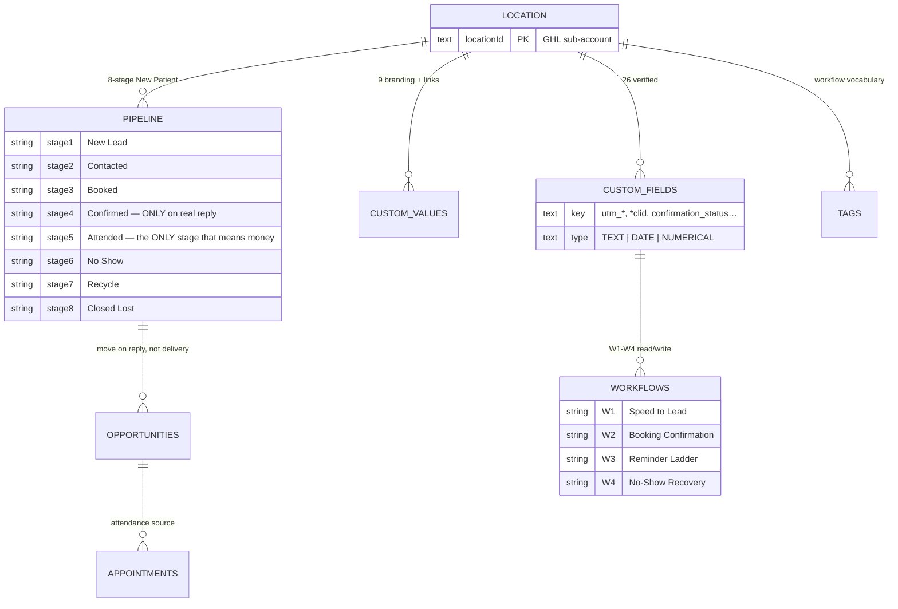

# GHL Provisioner — Build a Clinic's GoHighLevel Account, Then Verify It

A CLI that builds a chiropractic clinic's GoHighLevel sub-account from versioned data — 26 custom fields, 9 custom values, the 8-stage pipeline, the tag vocabulary — then **re-reads the account and confirms every field exists**. Plus the four show-rate workflows as a build sheet precise enough that two people build the same thing.

> ⚠️ **Not deployed anywhere (by design).** This is a local CLI: it runs from your machine with `GHL_API_TOKEN`. There is nothing Vercel could host here — no pages, no API routes. Reviewers should read the script + the workflow specs, then watch the verification output.
> 🎥 **Demo:** terminal recording of `--dry-run` → live run → `all 26 fields confirmed present`.

```bash
export GHL_API_TOKEN=...
node scripts/provision-showrate.mjs --location <locationId> --dry-run
node scripts/provision-showrate.mjs --location <locationId>
```

---

## 1. Why show rate is the whole point

For an agency paid **per patient who walks in**, a no-show isn't the clinic's problem — it's the agency's lost revenue. Unmanaged show rate in local healthcare sits in the 50s; closing the gap to 80% isn't a media-buying problem, it's four workflows and one design decision. On a pay-per-show contract that's the highest-leverage work in the business.

---

## 2. Part 1 — the account (what the script creates)

| Object | Count | Notes |
|---|---|---|
| Custom fields | **26** | 16 attribution fields (click IDs, UTMs, platform IDs) + 10 show-rate mechanics (`confirmation_status`, `confirmed_at`, `reminder/no-show/reschedule_counts`, …) |
| Custom values | **9** | Clinic name/address/phone, maps link, parking note, intake + reschedule links, practitioner, `value_per_attended` |
| Pipeline | **8 stages** | `New Lead → Contacted → Booked → Confirmed → Attended → No Show → Recycle → Closed Lost` |
| Tags | vocabulary | The keys the W1–W4 workflows branch on |



Two stages are load-bearing. **Confirmed ≠ Booked**: a booking someone replied to and one they ignored have very different show rates — collapsing them blinds every downstream report. **Attended** is the only stage that means money; every report and invoice joins on that exact name.

### Verify, don't trust

The run ends by re-reading the account and exiting non-zero unless all 26 fields confirm present:

```
all 26 fields confirmed present
```

A provisioner that reports success because nothing errored hands someone a half-built account. Checking a create call returned 200 ≠ checking the field exists — the difference surfaces six weeks later as a quietly empty report. Safe to re-run: "already exists" counts as success.

---

## 3. Part 2 — the four workflows (built by hand, specified like code)

**GoHighLevel's public API cannot create workflows.** Fields, values, pipelines, tags, calendars, contacts — API-manageable. The workflow builder — not. So the split is deliberate: the machine creates and verifies everything it can; the human clicks the rest from [`docs/workflow-specs.md`](docs/workflow-specs.md).

| | Workflow | Trigger → actions |
|---|---|---|
| **W1** | Speed to Lead | Contact created → SMS immediately (quiet-hours guard) → one nudge at +10 min → task for front desk |
| **W2** | Booking Confirmation | Appointment booked → confirmation ask → move to **Confirmed only on a real reply** |
| **W3** | Reminder Ladder | 24h + 2h reminders; the 2h copy differs by confirmed/unconfirmed |
| **W4** | No-Show Recovery | Marked no-show → rebook offer → hard stop after 3 no-shows |

**The design decision to defend:** move the opportunity on reply, never on delivery. Treating "message delivered" as "confirmed" merges two populations with different show rates and the pipeline can no longer tell you which bookings are real.

**Judgement calls:** 10 min (not 5) between first and second text — five reads automated, ten reads human; max 3 reminders (a fourth raises opt-outs, not show rate); stop after 3 no-shows; never say "reminder" — say the time.

---

## 4. Project map

```
scripts/provision-showrate.mjs   the provisioner (data-first: config as diffable arrays)
docs/workflow-specs.md           W1–W4 build sheets (field-by-field click paths)
docs/build-checklist.md          pre-launch gate — every item has failed on a real account
package.json                     single script: npm run provision
.env.example                     GHL_API_TOKEN
```

Run: `npm run provision -- --location <id> --dry-run` first (prints planned writes, changes nothing), then without the flag. Multi-tenancy is the point: run it twice (one chiro + one dental sub-account) and you've demonstrated the 500-client model.

---

## 5. Before a single ad runs

[`docs/build-checklist.md`](docs/build-checklist.md), last item first: **somebody at the front desk must mark appointments attended.** Train it before launch, check it week one. A system measuring a field nobody fills is measuring nothing — and under pay-per-show it's also under-billing.

---

## 6. Where this sits

Provisions the account [`../frontdesk`](../frontdesk) books into and produces the attendance data [`../pay-per-show`](../pay-per-show) invoices from. Serves **both** applications: Aspire's funnel follow-up and Conek's show-rate story run on these same four workflows.

---

Built by [Abdiwahid Ali](https://github.com/maqbuuul). Nairobi.
